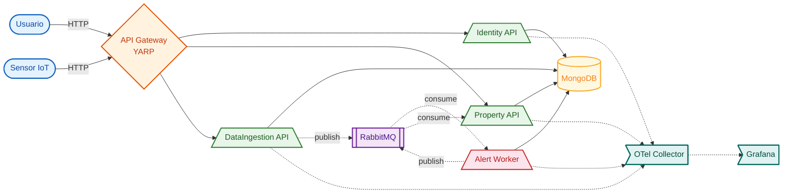

# AgroSolutions


Plataforma de agricultura de precisao baseada em microsservicos para monitoramento de propriedades rurais com sensores IoT em tempo real.

## Problema

A agricultura tradicional sofre com a falta de dados em tempo real sobre as condicoes das lavouras. Decisoes sobre irrigacao, manejo de pragas e colheita sao tomadas de forma empirica, gerando desperdicio de recursos e perda de produtividade.

## Solucao

AgroSolutions e uma plataforma IoT que coleta dados de sensores (umidade, temperatura, precipitacao) distribuidos nas propriedades rurais, processa alertas automaticos e fornece visibilidade em tempo real sobre o estado das lavouras.

## Arquitetura



## Tecnologias

| Tecnologia | Uso |
|---|---|
| .NET 8 | Runtime dos microsservicos |
| ASP.NET Core | APIs REST |
| MongoDB | Banco de dados NoSQL |
| RabbitMQ | Mensageria assincrona (Event Bus) |
| YARP | API Gateway (Reverse Proxy) |
| Docker / Docker Compose | Containerizacao |
| Kubernetes (Minikube) | Orquestracao de containers |
| OpenTelemetry | Metricas e traces distribuidos |
| Grafana | Dashboards de observabilidade |
| FluentValidation | Validacao de entrada |
| BCrypt | Hash de senhas |
| JWT | Autenticacao stateless |
| xUnit + Moq + FluentAssertions | Testes unitarios |
| GitHub Actions | CI/CD |

## Pre-requisitos

- [Docker Desktop](https://www.docker.com/products/docker-desktop/) (com Docker Compose)
- [.NET 8 SDK](https://dotnet.microsoft.com/download/dotnet/8.0) (para desenvolvimento)
- [Minikube](https://minikube.sigs.k8s.io/) (opcional, para deploy Kubernetes)

## Como Executar

### Com Docker Compose (recomendado)

```bash
# Iniciar todos os servicos
docker-compose up -d

# Ou usar o script PowerShell
./scripts/start-local.ps1
```

Apos iniciar, acesse:

| Servico | URL |
|---|---|
| API Gateway | http://localhost:5000 |
| Swagger Identity | http://localhost:5000/api/identity/swagger |
| Swagger Property | http://localhost:5000/api/property/swagger |
| Swagger DataIngestion | http://localhost:5000/api/sensors/swagger |
| RabbitMQ Management | http://localhost:15672 (guest/guest) |
| Grafana | http://localhost:3000 (admin/admin) |

### Com Minikube (Kubernetes)

```bash
./scripts/start-minikube.ps1
```

### Rodar Testes

```bash
dotnet test
```

## Endpoints da API

### Identity (`/api/identity`)

| Metodo | Rota | Descricao | Auth |
|--------|------|-----------|------|
| POST | `/auth/register` | Registrar usuario | Nao |
| POST | `/auth/login` | Autenticar | Nao |
| GET | `/auth/me` | Dados do usuario logado | Sim |

### Property (`/api/property`)

| Metodo | Rota | Descricao | Auth |
|--------|------|-----------|------|
| GET | `/` | Listar propriedades | Sim |
| GET | `/{id}` | Obter propriedade | Sim |
| POST | `/` | Criar propriedade | Sim |
| PUT | `/{id}` | Atualizar propriedade | Sim |
| DELETE | `/{id}` | Remover propriedade | Sim |
| GET | `/{id}/plots` | Listar talhoes | Sim |
| GET | `/{id}/plots/{plotId}` | Obter talhao | Sim |
| POST | `/{id}/plots` | Criar talhao | Sim |
| PUT | `/{id}/plots/{plotId}` | Atualizar talhao | Sim |
| DELETE | `/{id}/plots/{plotId}` | Remover talhao | Sim |

### DataIngestion (`/api/sensors`)

| Metodo | Rota | Descricao | Auth |
|--------|------|-----------|------|
| POST | `/humidity` | Enviar leitura de umidade | Nao |
| POST | `/temperature` | Enviar leitura de temperatura | Nao |
| POST | `/rainfall` | Enviar leitura de precipitacao | Nao |
| GET | `/{propertyId}/{plotId}` | Historico de leituras | Nao |
| GET | `/{propertyId}/{plotId}/latest` | Ultima leitura por tipo | Nao |

### Health Checks (todos os servicos)

| Rota | Descricao |
|------|-----------|
| `/health` | Liveness (servico rodando) |
| `/health/ready` | Readiness (MongoDB + RabbitMQ conectados) |

## Estrutura do Projeto

```
AgroSolutions/
├── .github/workflows/ci.yml          # Pipeline CI/CD
├── docs/                              # Documentacao
│   ├── architecture/                  # Arquitetura e NFR
│   └── postman/                       # Colecao Postman
├── infra/                             # Infraestrutura
│   ├── k8s/                           # Manifests Kubernetes
│   ├── grafana/                       # Dashboards Grafana
│   └── otel/                          # Config OpenTelemetry
├── scripts/                           # Scripts de automacao
├── src/
│   ├── ApiGateway/                    # YARP Gateway
│   ├── BuildingBlocks/                # Bibliotecas compartilhadas
│   │   ├── AgroSolutions.Common/      # Middleware, Extensions, OTel
│   │   └── AgroSolutions.EventBus.RabbitMQ/  # Event Bus
│   ├── Services/
│   │   ├── Identity/                  # Autenticacao (Domain/Infra/API)
│   │   ├── Property/                  # Propriedades (Domain/Infra/API)
│   │   ├── DataIngestion/             # Ingestao de dados (Domain/Infra/API)
│   │   └── Alert/                     # Alertas (Domain/Infra/Worker)
│   └── Simulator/                     # Simulador de sensores
├── tests/                             # Testes unitarios
├── docker-compose.yml                 # Orquestracao local
└── AgroSolutions.sln                  # Solution .NET
```

## Fluxo de Dados

1. **Sensores IoT** enviam leituras (umidade, temperatura, precipitacao) para o **DataIngestion API**
2. DataIngestion persiste no **MongoDB** e publica eventos no **RabbitMQ**
3. **Alert Worker** consome eventos, avalia regras de alerta e cria alertas quando necessario
4. Alert Worker notifica o **Property API** via RabbitMQ sobre mudancas de status
5. Property API atualiza o status da cultura no talhao correspondente
6. Todos os servicos exportam **metricas e traces** via **OpenTelemetry** para o **Grafana**

## Video de Demonstracao

> [Inserir link do video aqui]

## Equipe

- Daniel - Guilherme - Abrão

## Licenca

Este projeto foi desenvolvido como trabalho academico para a FIAP.
