# Arquitetura AgroSolutions

## Visao Geral

AgroSolutions segue uma **arquitetura de microsservicos** event-driven, onde cada servico tem responsabilidade unica e se comunica de forma assincrona via mensageria.

## Diagrama de Arquitetura

```mermaid
---
config:
  theme: base
  themeVariables:
    primaryColor: '#f5f5f5'
    edgeLabelBackground: '#ffffff'
    tertiaryColor: '#ffffff'
  flowchart:
    curve: basis
  layout: dagre
---
flowchart LR
 subgraph Clientes["Clientes"]
    direction TB
        USER(("👤\nUsuario Web / Mobile"))
        IOT(("📶\nSensores IoT"))
  end

 subgraph APIGW["API Gateway (:5000)"]
        GW["YARP Reverse Proxy"]
  end

 subgraph SERVICOS["Serviços Internos"]
    direction TB
    subgraph IDENTITY["Identity Service (:5001)"]
        direction TB
        ID_API["Identity API"]
        ID_DB[("MongoDB<br>users")]
    end
    subgraph PROPERTY["Property Service (:5002)"]
        direction TB
        PR_API["Property API"]
        PR_CONS["SensorUpdate Consumer"]
        PR_DB[("MongoDB<br>properties")]
    end
    subgraph DATAING["DataIngestion Service (:5003)"]
        direction TB
        DI_API["DataIngestion API"]
        DI_DB[("MongoDB<br>sensor_readings")]
    end
  end

 subgraph MQ["Mensageria"]
        RMQ_ALERT[/"alert-sensor-queue"/]
        RMQ_UPDATE[/"property-sensor-update-queue"/]
        RMQ_STATUS[/"property-alert-status-queue"/]
  end

 subgraph ALERT["Alert Service (Worker)"]
    direction TB
        AW_CONS["SensorData Consumer"]
        AW_RULES["Alert Rules Engine"]
        AW_DB[("MongoDB<br>alerts")]
  end

 subgraph OBS["Observabilidade"]
        OTEL["OpenTelemetry Collector"]
        GRAFANA(("📊 Grafana Dashboards"))
  end

    USER -- HTTP --> GW
    IOT -- HTTP --> GW
    GW -- /api/identity/* --> ID_API
    ID_API --> ID_DB
    GW -- /api/property/* --> PR_API
    PR_API --> PR_DB
    GW -- /api/sensors/* --> DI_API
    DI_API --> DI_DB
    DI_API -- publish --> RMQ_ALERT & RMQ_UPDATE
    RMQ_ALERT -- consume --> AW_CONS
    AW_CONS --> AW_RULES & AW_DB
    AW_CONS -- publish --> RMQ_STATUS
    RMQ_UPDATE -- consume --> PR_CONS
    RMQ_STATUS -- consume --> PR_CONS
    PR_CONS --> PR_DB
    ID_API -. OTLP .-> OTEL
    PR_API -. OTLP .-> OTEL
    DI_API -. OTLP .-> OTEL
    AW_CONS -. OTLP .-> OTEL
    OTEL -. Prometheus .-> GRAFANA

     USER:::clientes
     IOT:::clientes
     GW:::gateway
     ID_API:::identity
     ID_DB:::identity
     PR_API:::property
     PR_CONS:::property
     PR_DB:::property
     DI_API:::ingestion
     DI_DB:::ingestion
     AW_CONS:::alert
     AW_RULES:::alert
     AW_DB:::alert
     RMQ_ALERT:::mq
     RMQ_UPDATE:::mq
     RMQ_STATUS:::mq
     OTEL:::observ
     GRAFANA:::observ
    classDef clientes fill:#e3f2fd,stroke:#2196f3,stroke-width:1px
    classDef gateway fill:#e8f5e9,stroke:#4caf50,stroke-width:1px
    classDef identity fill:#fff3e0,stroke:#ff9800,stroke-width:1px
    classDef property fill:#f3e5f5,stroke:#9c27b0,stroke-width:1px
    classDef ingestion fill:#e0f7fa,stroke:#00bcd4,stroke-width:1px
    classDef alert fill:#ffebee,stroke:#f44336,stroke-width:1px
    classDef mq fill:#f1f8e9,stroke:#8bc34a,stroke-width:1px
    classDef observ fill:#ede7f6,stroke:#673ab7,stroke-width:1px
```



## Microsservicos

### 1. API Gateway (YARP)

- **Responsabilidade**: Ponto de entrada unico, roteamento de requests para os microsservicos
- **Tecnologia**: YARP (Yet Another Reverse Proxy)
- **Rotas**:
  - `/api/identity/*` -> Identity Service
  - `/api/property/*` -> Property Service
  - `/api/sensors/*` -> DataIngestion Service

### 2. Identity Service

- **Responsabilidade**: Registro e autenticacao de usuarios
- **Camadas**: Domain / Infrastructure / API
- **Funcionalidades**:
  - Registro com validacao (nome, email, senha)
  - Login com JWT token
  - Consulta de perfil do usuario autenticado
  - Hash de senhas com BCrypt
  - Indice unico no email (MongoDB)
- **Banco**: MongoDB (collection `users`)

### 3. Property Service

- **Responsabilidade**: Gerenciamento de propriedades rurais e talhoes
- **Camadas**: Domain / Infrastructure / API + Consumer
- **Funcionalidades**:
  - CRUD completo de propriedades (com soft delete)
  - CRUD de talhoes dentro de propriedades
  - Talhoes com cultura, coordenadas geograficas e dados de sensores
  - Consumer que atualiza dados de sensores nos talhoes em tempo real
  - Consumer que atualiza status de alerta nas culturas
  - Isolamento por proprietario (usuario so ve suas propriedades)
- **Banco**: MongoDB (collection `properties` com talhoes embedded)
- **Filas consumidas**: `property-sensor-update-queue`, `property-alert-status-queue`

### 4. DataIngestion Service

- **Responsabilidade**: Receber, validar e armazenar leituras de sensores IoT
- **Camadas**: Domain / Infrastructure / API
- **Funcionalidades**:
  - Ingestao de umidade (0-100%), temperatura (-50 a 60C), precipitacao (>= 0mm)
  - Validacao com FluentValidation por tipo de sensor
  - Consulta de historico paginado com filtros
  - Consulta de ultima leitura por tipo
  - Publicacao de eventos para Alert Worker e Property Service
- **Banco**: MongoDB (collection `sensor_readings`)
- **Filas publicadas**: `alert-sensor-queue`, `property-sensor-update-queue`

### 5. Alert Service (Worker)

- **Responsabilidade**: Processar leituras de sensores e gerar alertas automaticos
- **Camadas**: Domain / Infrastructure / Worker
- **Funcionalidades**:
  - Consome leituras da fila `alert-sensor-queue`
  - Avalia regras de alerta (Strategy pattern):
    - Umidade < 20%: Seca Critica
    - Umidade < 30%: Alerta de Seca
    - Temperatura > 40C: Temperatura Critica
    - Temperatura > 35C: Temperatura Alta
    - Temperatura < 5C: Temperatura Baixa
    - Precipitacao > 100mm: Chuva Muito Intensa
    - Precipitacao > 50mm: Chuva Intensa
  - Cria alertas no MongoDB quando regra e acionada
  - Desativa alertas quando valor normaliza
  - Notifica Property Service sobre mudancas de status
- **Banco**: MongoDB (collection `alerts`)
- **Filas consumidas**: `alert-sensor-queue`
- **Filas publicadas**: `property-alert-status-queue`

## Fluxo de Dados Detalhado

### Fluxo 1: Autenticacao

```
Usuario -> Gateway -> Identity API -> MongoDB
                                   -> JWT Token
```

### Fluxo 2: Ingestao de Sensor

```
Sensor IoT -> Gateway -> DataIngestion API -> MongoDB (persist)
                                           -> RabbitMQ [alert-sensor-queue]
                                           -> RabbitMQ [property-sensor-update-queue]
```

### Fluxo 3: Processamento de Alerta

```
RabbitMQ [alert-sensor-queue] -> Alert Worker -> Avalia Regras
                                              -> MongoDB (cria/desativa alerta)
                                              -> RabbitMQ [property-alert-status-queue]
```

### Fluxo 4: Atualizacao de Propriedade

```
RabbitMQ [property-sensor-update-queue] -> Property Consumer -> MongoDB (atualiza sensor no talhao)
RabbitMQ [property-alert-status-queue]  -> Property Consumer -> MongoDB (atualiza status da cultura)
```

### Fluxo 5: Observabilidade

```
Todos os servicos -> OTLP -> OTel Collector -> Prometheus Exporter -> Grafana
```

## Justificativas Tecnicas

### Por que Microsservicos?

- **Escalabilidade independente**: O DataIngestion pode receber milhares de leituras/s enquanto o Identity tem trafego baixo
- **Deploy independente**: Alterar regras de alerta nao requer deploy dos outros servicos
- **Isolamento de falhas**: Se o Alert Worker cair, a ingestao de dados continua funcionando

### Por que MongoDB?

- **Schema flexivel**: Talhoes sao documentos embedded dentro de propriedades, facilitando queries
- **Performance em escrita**: Ideal para alta taxa de ingestao de dados de sensores
- **Facilidade operacional**: Unico banco para todos os servicos (com collections separadas)

### Por que RabbitMQ?

- **Desacoplamento**: DataIngestion nao precisa conhecer Alert Worker ou Property Service
- **Garantia de entrega**: Mensagens persistentes com ACK manual
- **Processamento assincrono**: Alertas sao processados sem bloquear a ingestao

### Por que YARP como Gateway?

- **Nativo .NET**: Sem dependencias externas (vs Ocelot descontinuado)
- **Performance**: Baseado em Kestrel, excelente throughput
- **Configuracao simples**: Via appsettings.json ou environment variables

### Por que OpenTelemetry?

- **Padrao aberto**: Vendor-neutral, sem lock-in
- **Instrumentacao automatica**: ASP.NET Core + HTTP client out-of-the-box
- **Metricas customizadas**: Contadores de negocios (logins, leituras, alertas)
